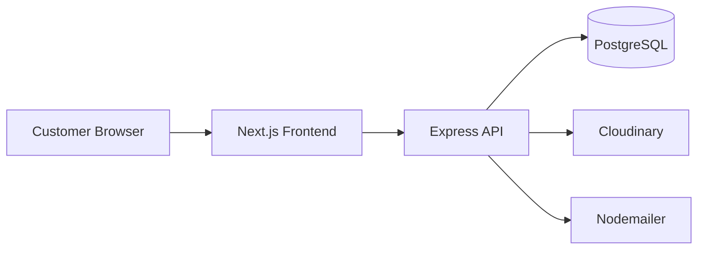
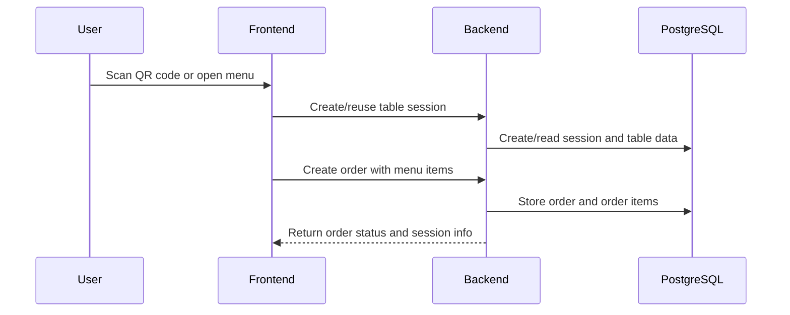
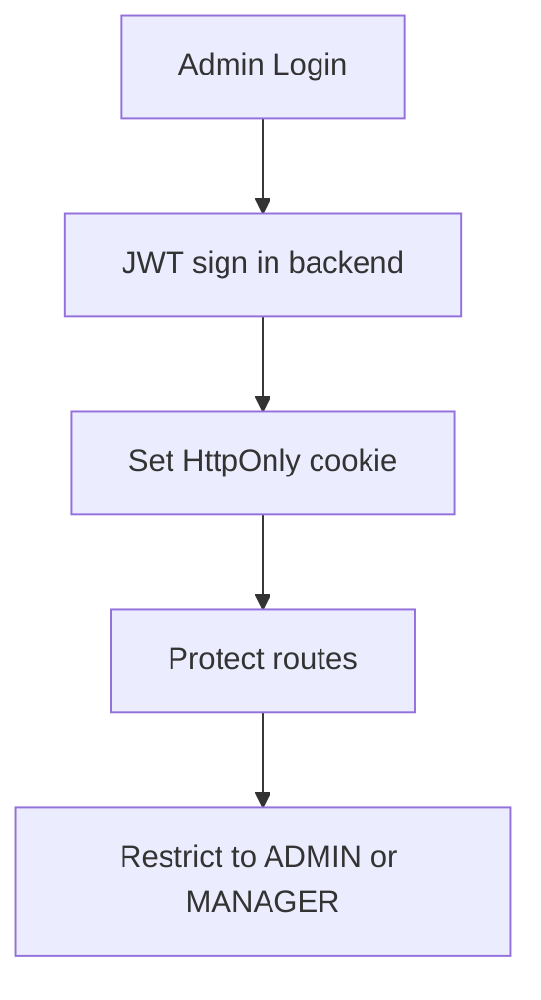

# PixelShop

> Digital menu, table-based ordering, and admin operations for restaurants and hospitality teams.

     

[Live Demo](https://pixelshops.vercel.app/) • [GitHub](https://github.com/PixelNoah-ui)

## Overview

PixelShop is a full-stack restaurant ordering platform built around QR-scanned tables, a customer-facing menu, and an administrative dashboard for order and menu management. The current codebase implements table session handling, menu browsing, order creation and tracking, menu uploads to Cloudinary, and protected admin workflows.

### What it is for

- Restaurants and cafés that want a contactless menu experience
- Staff who need to manage tables, menu items, and incoming orders
- Customers who can browse a menu and track order status from their table

### Problems it solves

- Eliminates paper menus and manual order capture
- Offers table-specific digital sessions without requiring a separate app install
- Gives admins a structured way to manage menu content and orders

### Key capabilities

- QR-code based table entry
- Menu browsing with search, sorting, price filtering, and pagination
- Cart-based order creation tied to a table session
- Order lifecycle states: Pending, Preparing, Ready, Delivered, Cancelled
- Admin dashboard metrics and recent-order summaries
- Restaurant profile management
- Image upload and Cloudinary storage for menu items

## Live Demo

- https://pixelshops.vercel.app/

## Screenshots

Placeholder assets are included under [docs/screenshots](docs/screenshots).


Landing Page


Products


Product Details


Admin Dashboard

> Replace these placeholders with real screenshots after deployment.

## Features

### Customer Features

- QR-code table scanning and session initialization
- Menu browsing with filters and pagination
- Add-to-cart experience and order placement
- Active orders tracking with status progress steps

### Admin Features

- Protected admin and manager authentication
- Menu item CRUD operations
- Table CRUD and QR generation
- Order review, status updates, read/unread handling
- Dashboard stats and recent orders
- Restaurant contact information management

### Authentication

- JWT-based authentication for admin users
- HTTP-only cookie-based auth for both admin and session flows
- Role-based authorization for ADMIN and MANAGER roles

### Payments

- Not detected from the current codebase.

### Order Management

- Orders are created per table session
- Status lifecycle is implemented in Prisma and surfaced in the UI
- Order limits and expiry windows are enforced server-side

### Product Management

- Menu items support name, description, price, category, preparation time, availability, and image URL
- Image processing uses Sharp and Cloudinary

### Performance

- Server-side pagination on menu and orders endpoints
- Rate limiting is enabled for API traffic
- Frontend uses React Query for cached data fetching

### Security

- Helmet middleware
- CORS configuration
- Rate limiting
- Password hashing with bcrypt
- Account lockout after repeated failed logins
- JWT stored in secure cookies

### Responsive Design

- The frontend is built with Next.js and Tailwind-based components and is intended for responsive use on mobile and desktop devices.

## Tech Stack

### Frontend

- Next.js 16
- React 19
- TypeScript
- Tailwind CSS
- Zustand for client state
- TanStack React Query
- shadcn/ui style primitives

### Backend

- Node.js
- Express 5
- TypeScript
- JWT and cookie-based auth
- Helmet, CORS, Morgan, express-rate-limit
- Multer, Sharp, Cloudinary, Nodemailer, QR Code, Puppeteer

### Database

- PostgreSQL
- Prisma ORM

### Authentication

- JWT access tokens in cookies
- Session cookies for customer table sessions
- Role-based authorization through custom middleware

### Cloud Storage

- Cloudinary for menu image uploads

### Deployment

- Frontend is compatible with Vercel (the live demo is hosted there)
- Backend deployment target is not specified in the repository

### Developer Tools

- Prisma CLI
- TypeScript compiler
- ESLint

## Architecture

The application follows a three-layer architecture:

1. Frontend: Next.js application for menu browsing and order tracking
2. Backend API: Express service that handles authentication, sessions, menu management, orders, tables, and dashboard analytics
3. Database: PostgreSQL accessed through Prisma

### High-level architecture



### Request flow



### Authentication flow



## Folder Structure

```text
.
├── backend/
│   ├── prisma/
│   │   ├── migrations/
│   │   └── schema.prisma
│   ├── src/
│   │   ├── controller/
│   │   ├── lib/
│   │   ├── middleware/
│   │   ├── router/
│   │   ├── utils/
│   │   ├── index.ts
│   │   └── server.ts
│   ├── package.json
│   └── tsconfig.json
├── docs/
│   └── screenshots/
├── frontend/
│   ├── app/
│   ├── components/
│   ├── hooks/
│   ├── lib/
│   ├── public/
│   ├── store/
│   ├── types/
│   ├── package.json
│   └── next.config.ts
└── README.md
```

## Installation

### 1. Clone the repository

```bash
git clone https://github.com/PixelNoah-ui/E-commerce.git
cd SAAS_DIGITAL_MENU
```

### 2. Install dependencies

```bash
cd backend && npm install
cd ../frontend && npm install
```

### 3. Configure environment variables

Copy the example environment file and adjust values:

```bash
cp .env.example .env
```

### 4. Prepare the database

```bash
cd backend
npx prisma migrate dev
npx prisma generate
```

### 5. Run the development servers

Backend:

```bash
cd backend
npm run dev
```

Frontend:

```bash
cd frontend
npm run dev
```

## Environment Variables

A complete example is available in [.env.example](.env.example).

## Database Documentation

Detailed schema documentation is available in [docs/DATABASE.md](docs/DATABASE.md).

## API Documentation

Detailed endpoint documentation is available in [docs/API.md](docs/API.md).

## Deployment

Detailed deployment guidance is available in [docs/DEPLOYMENT.md](docs/DEPLOYMENT.md).

## Security

Security measures detected in the codebase include:

- Helmet middleware for response hardening
- CORS restrictions for trusted origins
- Rate limiting on API routes
- Password hashing with bcrypt
- Secure HTTP-only cookies for auth and sessions
- Account lockout based on repeated failed logins

## Performance Optimizations

The current codebase includes:

- Backend pagination for menu items and orders
- React Query caching in the frontend
- Image resizing and WebP conversion before Cloudinary upload
- Session expiry to reduce stale table sessions

## Code Quality Audit

A structured review is available in [docs/CODE_QUALITY_AUDIT.md](docs/CODE_QUALITY_AUDIT.md).

## Future Improvements

Suggested improvements are listed in [docs/IMPROVEMENTS.md](docs/IMPROVEMENTS.md).

## Contributing

Contributions are welcome.

1. Fork the repository
2. Create a feature branch
3. Make focused changes with clear commit messages
4. Open a pull request with a summary and test evidence

Please keep documentation aligned with the implementation and avoid introducing features that are not reflected in the codebase.

## License

This project is licensed under the MIT License. See [LICENSE](LICENSE) for details.

## Author

- Developer: PixelNoah
- GitHub: https://github.com/PixelNoah-ui
- Portfolio: https://pixelshops.vercel.app/
