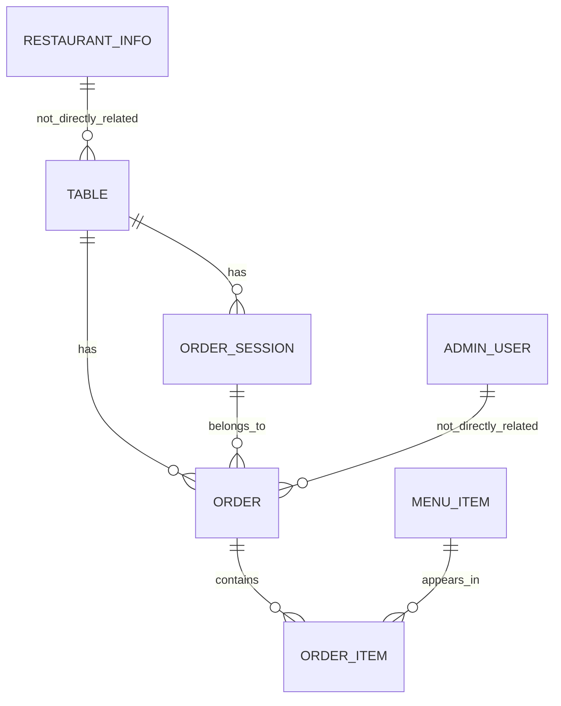

# Database Documentation

## Overview

The backend uses PostgreSQL through Prisma. The schema defines tables for restaurants, menu items, orders, order sessions, tables, and admin users.

## Prisma Schema Summary

### Enums

- `OrderStatus`: `PENDING`, `PREPARING`, `READY`, `DELIVERED`, `CANCELLED`
- `OrderSessionStatus`: `ACTIVE`, `EXPIRED`, `CLOSED`
- `UserRole`: `ADMIN`, `MANAGER`, `STAFF`
- `TableStatus`: `AVAILABLE`, `OCCUPIED`, `RESERVED`

### Models

#### Table

Fields:

- `id` (UUID, primary key)
- `tableNumber` (Int, unique)
- `capacity` (Int)
- `status` (TableStatus, default `AVAILABLE`)
- `qrToken` (String, unique)
- `isActive` (Boolean, default `true`)
- `createdAt`, `updatedAt`

Relationships:

- One table has many orders
- One table has many order sessions

#### MenuItem

Fields:

- `id` (UUID, primary key)
- `name` (String)
- `description` (String, optional)
- `price` (Decimal)
- `imageUrl` (String, optional)
- `imagePublicId` (String, optional)
- `category` (String)
- `preparationTime` (Int, default 15)
- `isAvailable` (Boolean, default `true`)
- `createdAt`, `updatedAt`

Relationships:

- One menu item has many order items

Indexes:

- `category`
- `price`
- `createdAt`

#### Order

Fields:

- `id` (UUID, primary key)
- `tableId` (UUID foreign key)
- `orderSessionId` (UUID foreign key, optional)
- `status` (OrderStatus, default `PENDING`)
- `totalAmount` (Decimal)
- `isRead` (Boolean, default `false`)
- `createdAt`, `updatedAt`

Relationships:

- Belongs to one table
- Belongs to one order session (optional)
- Has many order items

Indexes:

- `tableId`
- `status`
- `orderSessionId`
- `isRead`

#### OrderSession

Fields:

- `id` (UUID, primary key)
- `tableId` (UUID foreign key)
- `sessionToken` (String, unique)
- `status` (OrderSessionStatus, default `ACTIVE`)
- `expiresAt` (DateTime)
- `createdAt`, `updatedAt`

Relationships:

- Belongs to one table
- Has many orders

#### OrderItem

Fields:

- `id` (UUID, primary key)
- `orderId` (UUID foreign key)
- `menuItemId` (UUID foreign key)
- `quantity` (Int)
- `price` (Decimal)
- `createdAt`

Relationships:

- Belongs to one order
- Belongs to one menu item

#### AdminUser

Fields:

- `id` (UUID, primary key)
- `name` (String)
- `email` (String, unique)
- `password` (String)
- `role` (UserRole, default `STAFF`)
- `resetToken` (Text, optional)
- `resetTokenExpiry` (DateTime, optional)
- `passwordChangedAt` (DateTime, optional)
- `failedLoginAttempts` (Int, default `0`)
- `lockUntil` (DateTime, optional)
- `createdAt`

#### RestaurantInfo

Fields:

- `id` (UUID, primary key)
- `name` (String)
- `phone` (String)
- `address` (String)
- `telegramUsername` (String)
- `createdAt`, `updatedAt`

## ER Diagram

## Notes

- The schema uses UUID primary keys and PostgreSQL-specific decimal fields.
- Table and session flows are central to the ordering model.
- The current implementation does not include a dedicated payments table or customer account model.
